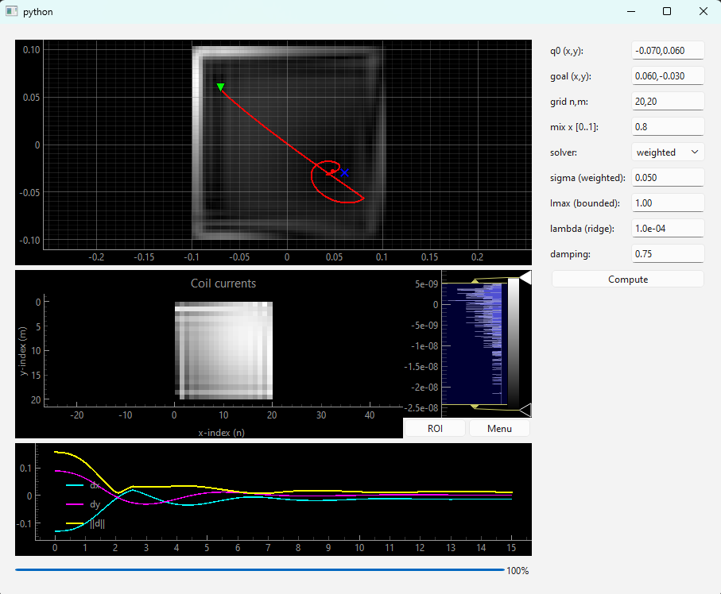

# mechsp

## Project Sketch
**Working title:** Artificial Mechanical Spacetimes for Passive Multi‑Object Manipulation

**Researcher:** Jasper Juchem 

---

## Abstract
This project proposes a mechanics‑faithful framework for **passive, field‑driven manipulation** of many simple objects (“marbles”) in the plane. We synthesize **spatial energy landscapes**—potential \(K(x,y)\), skew/gyroscopic interconnection \(N(x,y)\), and (where relevant) effective inertia patterns \(M(x,y)\)—that guarantee **passivity**, **obstacle avoidance**, and **convergence** to specified goals. The fields are then **physically realized** on **actuator arrays** (magnetic coils), enabling multi‑agent transport **without onboard control**. Conceptually, this extends recent “artificial spacetime” ideas in reactive robotics to **mechanically realizable** Hamiltonian‑style fields, unifying **geometric control** (IDA‑PBC), **navigation functions**, and **programmable manipulation surfaces**. The result should become reproducible on an open‑hardware platform and an open‑source ROS2 toolchain.

## Example
A 20 by 20 grid of magnetic arrays positions a ball from an initial position (green triangle) to a the destiny (blue cross), using an imposed vector field obtained by imposing a mechanics-inspired field. In the top plot, you see the trajectory of the ball. In the middle plot, the current to each magnetic coil is given. This is inversely calculated from the vector field that should be applied on the ball. In the bottom graph, the error in the x- and y-direction is given in time, as well as the Euclidian distance between the ball and the destiny in time.
