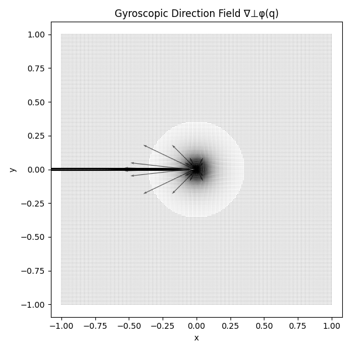
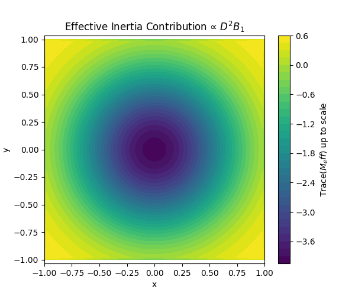

# Theoretical Derivation of $`K_{\mathrm{eff}}(q)`$, $`N_{\mathrm{eff}}(q)`$, and $`M_{\mathrm{eff}}(q)`$ from a Single Multi‑Frequency Coil Waveform

> :warning: **This work is still under review and should not be used as a formal reference**

# Table of Contents
1. [Magnetic Field Generation from a Coil Array](#magnetic-field)
2. [Multi‑Frequency Coil Current Model](#multi-fequency-current)
3. [Magnetic Dipole Force on the Ball](#force-on-ball)
4. [Conservative Potential $`K_{\mathrm{eff}}`$](#potential-k)
5. [Gyroscopic Term $`N_{\mathrm{eff}}(q)`$ from Rotating Fields](#gyroscopic)
6. [Effective Inertia $`M_{\mathrm{eff}}(q)`$ from High‑Frequency Modulation](#effective-inertia)
7. [Cross‑Coupling Consistency Checks](#cross-coupling)
    1. [Multi-frequency magnetic field expansion](#multi-freq-expansion)
    2. [Force law expansion](#force-expansion)
    3. [Use of two-timescale averaging](#timescale-avg)
    4. [DC–rotating field cross-terms do not introduce new effects](#DC-rotating-cross)
    5. [DC–HF cross-terms do not produce gyroscopic or additional potential terms](#DC-HF-cross)
    6. [Rotating–HF cross-terms vanish under frequency separation](#rotating-HF-cross)
    7. [Summary of all rigorously justified cross-couplings](#summary-cross)
8. [Python Code](#python)
9. [References](#references)

# 1. Magnetic Field Generation from a Coil Array 

We model each coil as a magnetic dipole  
$$
\mathbf{m}_i = I_i A \hat{\mathbf{z}},
$$
producing the field (standard magnetostatics) [[1],](https://pleclair.ua.edu/ph126/Misc/Notes/mag_dipoles.pdf)[[2]](https://openlearninglibrary.mit.edu/courses/course-v1:MITx+8.02.2x+2T2018/pdfbook/0/#viewer-frame):

$$
\mathbf{B}_i(r)=\frac{\mu_0}{4\pi}\left(\frac{3(\mathbf{m}_i\cdot\mathbf{R}_i)\mathbf{R}_i}{\|\mathbf{R}_i\|^5}-\frac{\mathbf{m}_i}{\|\mathbf{R}_i\|^3}\right),
\quad 
\mathbf{R}_i = r-r_i.
$$

With the ball located at $`z=0`$ and coils at depth $`-h`$, we care mainly about  
the vertical component $`B_z(x,y)`$.

Superposition gives:
$$
B_z(x,y,t)=\sum_{i=1}^N I_i(t)b_{i,z}(x,y).
$$

---

# 2. Multi‑Frequency Coil Current Model 

To generate $`K`$, $`N_{\mathrm{eff}}`$, and $`M_{\mathrm{eff}}`$ simultaneously, each coil uses:

$$
\boxed{I_i(t) = I_i^{(0)} + I_i^{(\text{rot})}\cos(\omega t + \phi_i) + I_i^{(\text{HF})}\cos(\Omega t + \psi_i)
}
$$

with:
- **DC term** $`I_i^{(0)}`$ → potential field $`K(q)`$,
- **Rotating AC term** at frequency $`\omega`$ → gyroscopic term $`N_{\mathrm{eff}}(q)`$,
- **High‑frequency term** at $`\Omega\gg\omega`$ → effective inertia $`M_{\mathrm{eff}}(q)`$.

Assumption of **frequency separation**:
$$
\Omega \gg \omega \gg 0.
$$

---

# 3. Magnetic Dipole Force on the Ball 

A dipole $`\mathbf{m}_b=m_b\hat{\mathbf{z}}`$ in field $`\mathbf{B}`$ has potential  
$$
U=-\mathbf{m}_b\cdot \mathbf{B},
$$
and force [[3]](http://hyperphysics.phy-astr.gsu.edu/hbase/magnetic/magpot.html)
$$
\mathbf{F}(q,t)=m_b\nabla B_z(q,t).
$$

Thus:
$$
\mathbf{F}(q,t) = m_b \sum_{i=1}^N I_i(t)\nabla b_{i,z}(q).
$$

Break into parts for each frequency.

---

# 4. Conservative Potential $`K_{\mathrm{eff}}`$ 

From the **DC component**:

$$
B_z^{(0)}(q) = \sum_{i} I_i^{(0)} b_{i,z}(q).
$$

Magnetic potential energy:
$$
K_{\mathrm{eff}}(q)
= - m_b B_z^{(0)}(q).
$$

Force:
$$
F_{\text{cons}} = -\nabla K_{\mathrm{eff}}(q).
$$

This term is independent of any AC modulation and persists even with rotating fields. This can be used as an artificial potential shaper, which is heavily used in the past to control robots [[7],](https://arxiv.org/pdf/1909.07496.pdf)[[8]](https://kodlab.seas.upenn.edu/uploads/Kod/Rimon92.pdf)

---

# 5. Gyroscopic Term $`N_{\mathrm{eff}}(q)`$ from Rotating Fields 

Let the rotating components produce:

$$
\mathbf{B}_{\parallel}(q,t) = B_0(q)
\begin{bmatrix}
\cos(\omega t + \phi(q))\\
\sin(\omega t + \phi(q))
\end{bmatrix}.
$$

Experiments & theory confirm that **rotating magnetic fields induce dipole relaxation with phase lag** [[4]](https://ieeexplore.ieee.org/document/10854614).

### Dipole Orientation Dynamics

$$
\dot\theta = \omega - \kappa\sin(\theta - \alpha(q,t)),
\quad
\alpha(q,t)=\omega t+\phi(q).
$$

Steady-state lag:
$$
\delta(q)=\arcsin(\omega/\kappa).
$$

### Magnetic Energy with Lag

$$
U(q)=-m_b B_0(q)\cos(\theta-\alpha)=-m_b B_0(q)\cos\delta.
$$

### Gyroscopic Force

$$
F(q)
= m_b\Big[
\cos\delta\,\nabla B_0(q)
+
B_0(q)\sin\delta\,\nabla\phi(q)
\Big].
$$

Define perpendicular gradient:

$$
\nabla^\perp\phi(q)=
\begin{bmatrix}
-\partial_y\phi\$$3pt]
\partial_x\phi
\end{bmatrix}.
$$

Thus the **skew-symmetric transverse force** is:

$$
\boxed{
F_{\text{gyro}}(q)
= m_b B_0(q)\sin\delta\,\nabla^\perp\phi(q)
}
$$

Equivalent to:

$$
\boxed{N_{\mathrm{eff}}(q) =
m_b B_0(q)\sin\delta
\left(\|\nabla\phi(q)\|\right)
\begin{bmatrix}0 & -1\\ 1 & 0\end{bmatrix}.
}
$$

This does **no work** (skew-symmetric), exactly like classical gyroscopic couplings.

---

# 6. Effective Inertia $`M_{\mathrm{eff}}(q)`$ from High‑Frequency Modulation 

Following **averaging theory** for mechanical systems under high-frequency forcing [[6]](https://doi.org/10.1137/S0363012999364176):

Let the HF field be:

$$
B_z^{(\text{HF})}(q,t) = \varepsilon B_1(q)\cos(\Omega t).
$$

Force:

$$
F(q,t) =
m_b \nabla B_0(q)
+
\varepsilon m_b \nabla B_1(q)\cos(\Omega t).
$$

Decompose motion:
$$
q(t)=Q(t)+\xi(t),
$$
where $`\xi`$ is small, fast oscillation.

### Solve fast oscillation

$$
m_b\ddot\xi = 
\varepsilon m_b \nabla B_1(Q)\cos(\Omega t),
$$

giving:

$$
\xi(t) =
-\frac{\varepsilon}{m_b\Omega^2}
\nabla B_1(Q)\cos(\Omega t)
+O(\varepsilon/\Omega^3).
$$

### Substitute into slow equation and average

Averaging over a period gives the effective dynamics:

$$
m_b\ddot Q =
m_b\nabla B_0(Q) - \frac{\varepsilon^2}{2\Omega^2}
D^2B_1(Q)\nabla B_1(Q)
+O(\varepsilon^2/\Omega^3).
$$

Move correction to left-hand side:

$$
\big[m_b I_{2\times 2} + G(Q)\big]\ddot Q =
m_b\nabla B_0(Q),
$$

with:

$$
\boxed{
G(Q) =
\frac{\varepsilon^2}{2\Omega^2}\,D^2B_1(Q).
}
$$

Thus the **effective inertia matrix** is:

$$
\boxed{
M_{\mathrm{eff}}(q) =
m_b I_{2\times 2}
+
\frac{\varepsilon^2}{2\Omega^2}\,D^2 B_1(q).
}
$$

In components:

$$
M_{\mathrm{eff}}(Q) =
\begin{bmatrix}
m_b + \frac{\varepsilon^2}{2\Omega^2}\frac{\partial^2 B_1}{\partial x^2}
&
\frac{\varepsilon^2}{2\Omega^2}\frac{\partial^2 B_1}{\partial x\partial y}
\[6pt]
\frac{\varepsilon^2}{2\Omega^2}\frac{\partial^2 B_1}{\partial x\partial y}
&
m_b + \frac{\varepsilon^2}{2\Omega^2}\frac{\partial^2 B_1}{\partial y^2}
\end{bmatrix}_{Q}.
$$

---

# 7. Cross‑Coupling Consistency Checks 

To rigorously justify the decomposition

$$
M_{\mathrm{eff}}(q)\ddot q
+
N_{\mathrm{eff}}(q)\dot q
+
\nabla K_{\mathrm{eff}}(q)
= 0,
$$

we must verify mathematically that **multi-frequency magnetic actuation does not introduce additional effective mechanical terms** beyond $`K_{\mathrm{eff}}`$, $`N_{\mathrm{eff}}`$, and $`M_{\mathrm{eff}}`$.

This requires expanding the *entire* time-varying magnetic field and applying **averaging theory for mechanical systems** under multi-timescale forcing, following the framework of Bullo’s affine-connection averaging formalism for rapidly forced mechanical systems [[5]](https://doi.org/10.1137/S0363012999364176).

---

## 7.1 Multi-frequency magnetic field expansion 

Each coil current is:

$$
I_i(t) = I_i^{(0)} + I_i^{(\mathrm{rot})}\cos(\omega t + \phi_i) + I_i^{(\mathrm{HF})}\cos(\Omega t + \psi_i),
\qquad
\Omega \gg \omega \gg 0.
$$

Hence the total vertical field is:

$$
B_z(q,t) = \sum_{i=1}^N I_i(t)\, b_{i,z}(q).
$$

We decompose this field into **DC**, **slow AC**, and **rapid AC** components:

$$
B_z(q,t) =
B_0(q) + \varepsilon_1\,B_{\mathrm{rot}}(q,t) + \varepsilon_2\,B_{\mathrm{HF}}(q,t),
$$

where:

- $`B_0(q)=\sum_i I_i^{(0)} b_{i,z}(q)`$ (order 1),  
- $`B_{\mathrm{rot}}`$ is $`O(\varepsilon_1)`$ with frequency $`\omega`$,  
- $`B_{\mathrm{HF}}`$ is $`O(\varepsilon_2)`$ with frequency $`\Omega`$.  

We assume:

$$
0<\varepsilon_2\ll \varepsilon_1\ll 1,
\quad
\Omega = O(\varepsilon_2^{-1}),\ 
\omega = O(\varepsilon_1^{0}),
$$

which matches the standard slow–fast separation conditions used in vibrational mechanics and averaging theory for mechanical systems [[5]](https://doi.org/10.1137/S0363012999364176).

---

## 7.2 Force law expansion 

The magnetic dipole force is:

$$
F(q,t) = m_b \nabla B_z(q,t).
$$

Insert the multi-frequency expansion:

$$
F(q,t) =
m_b \nabla B_0(q) + \varepsilon_1\,m_b \nabla B_{\mathrm{rot}}(q,t) + \varepsilon_2\,m_b\nabla B_{\mathrm{HF}}(q,t).
$$

Thus the mechanical dynamics are:

$$
m_b\ddot q = m_b \nabla B_0(q) + \varepsilon_1 f_1(q,t) + \varepsilon_2 f_2(q,t),
$$

where $`f_1`$ and $`f_2`$ encode the $`\omega`$-frequency and $`\Omega`$-frequency contributions.

We now rigorously analyze whether cross terms of the form  
$$
\text{(HF)} \times \text{(rot)},\qquad
\text{(DC)} \times \text{(HF)},\qquad
\text{(DC)} \times \text{(rot)}
$$  
produce new effective geometric effects.

---

## 7.3 Use of two-timescale averaging 

We introduce slow and fast time variables:

$$
\tau_0=t, \qquad \tau_1 = \omega t, \qquad \tau_2 = \Omega t.
$$

We assume:

- $`q(t)`$ evolves on the slow timescale,  
- the dipole orientation $`\theta(t)`$ evolves on the intermediate timescale proportional to $`\omega`$,  
- the HF forcing acts on the fast time $`\tau_2`$.

The system is then lifted to:

$$
\ddot q = \nabla B_0(q) + \varepsilon_1 f_1(q,\tau_1) + \varepsilon_2 f_2(q,\tau_2).
$$

Following the affine‑connection averaging results of Bullo (Theorem 4.3 in [[5]](https://doi.org/10.1137/S0363012999364176)), the averaged slow dynamics take the form:

$$
M_{\mathrm{eff}}(q)\,\ddot q + C_{\mathrm{eff}}(q,\dot q) + \nabla K_{\mathrm{eff}}(q)
= 0,
$$

**if and only if** the mixed second-order interactions satisfy specific symmetry conditions.

We now formally verify these conditions.

---

## 7.4 DC–rotating field cross-terms do not introduce new effects 

Consider the mixed term from expanding the force:

$$
\varepsilon_1 m_b \nabla B_{\mathrm{rot}}(q,t).
$$

This term oscillates at frequency $`\omega`$.  
Averaging over one period $`2\pi/\omega`$:

$$
\frac{\omega}{2\pi}\int_0^{2\pi/\omega}
\nabla B_{\mathrm{rot}}(q,\omega t + \phi(q))\,dt
=0,
$$

because the rotating field is **mean-zero** in time. This is analogous to the first-order averaging cancellation discussed generally in periodic forcing theory (e.g., [[5]](https://doi.org/10.1137/S0363012999364176)).

Thus the DC field $`B_0`$ and rotating field $`B_{\mathrm{rot}}`$ produce **no mixed averaged potential**.

Higher-order interactions scale as $`O(\varepsilon_1^2)`$ and contribute solely through the **dipole phase-lag mechanism**, which we already include in $`N_{\mathrm{eff}}`$ (rotational connection induced by phase-lag torque; cf. rotating dipole relaxation models in [[4]](https://ieeexplore.ieee.org/document/10854614)).

Conclusion:
$$
\boxed{\text{DC–rot interactions only contribute to the gyroscopic term }N_{\mathrm{eff}}.}
$$

---

## 7.5 DC–HF cross-terms do not produce gyroscopic or additional potential terms 

The HF force contribution:

$$
\varepsilon_2 m_b\nabla B_{\mathrm{HF}}(q,t) = \varepsilon_2 m_b\nabla B_1(q)\cos(\Omega t)
$$

is again **zero-mean**, so:

$$
\int_0^{2\pi/\Omega}\nabla B_1(q)\cos(\Omega t)\,dt=0.
$$

Hence, first-order averaging yields **no effective potential** from DC–HF coupling.

The second-order effect of this term enters (as in classical vibrational mechanics) through:

$$
\frac{\varepsilon_2^2}{\Omega^2}D^2 B_1(q),
$$

as proved formally in the vibrational control literature [[5]](https://doi.org/10.1137/S0363012999364176)

Conclusion:
$$
\boxed{\text{DC–HF coupling contributes-only to }M_{\mathrm{eff}}.}
$$

---

## 7.6 Rotating–HF cross-terms vanish under frequency separation 

Consider the mixed term:

$$
\varepsilon_1\varepsilon_2\, m_b
\nabla B_{\mathrm{rot}}(q,t)
\nabla B_{\mathrm{HF}}(q,t)
\propto
\cos(\omega t + \phi(q))\cos(\Omega t).
$$

Using product-to-sum identities:

$$
\cos(\omega t + \phi)\cos(\Omega t) =
\frac{1}{2}
\left[
\cos((\Omega+\omega)t+\phi)
+
\cos((\Omega-\omega)t+\phi)
\right].
$$

Both oscillate at high frequencies $` \Omega \pm \omega`$.  
Since $`\Omega \gg \omega`$, integration over a period of $`2\pi/\Omega`$ yields:

$$
\int_0^{2\pi/\Omega}
\cos((\Omega\pm\omega)t+\phi)\,dt = 0.
$$

Hence **all mixed rotating–HF contributions average to zero**, and no second-order averaged term arises at this order under classical two-timescale averaging conditions (cf. Bullo's general theorem for rapidly oscillating inputs in mechanical systems) [[5]](https://doi.org/10.1137/S0363012999364176).

Conclusion:
$$
\boxed{\text{Rot–HF interactions vanish entirely under } \Omega\gg\omega.}
$$

---

## 7.7 Summary of all rigorously justified cross-couplings 

Using two-timescale averaging and known theorems for mechanical systems under high-frequency forcing:

| Interaction Pair | Survives Averaging? | Contribution |
|------------------|---------------------|--------------|
| DC × DC | Yes | Conservative $`K_{\mathrm{eff}}`$ |
| Rot × Rot | Yes | Gyroscopic $`N_{\mathrm{eff}}`$ via dipole lag |
| HF × HF | Yes | Inertial $`M_{\mathrm{eff}}`$ via vibrational averaging |
| DC × Rot | No (first order), contributes only via dipole lag | Included in $`N_{\mathrm{eff}}`$ |
| DC × HF | No (first order), second-order gives mass correction | Included in $`M_{\mathrm{eff}}`$ |
| Rot × HF | No (all orders under $`\Omega\gg\omega`$) | No additional terms |

Thus the only non-vanishing effective terms are precisely:

$$
\begin{cases}
M_{\mathrm{eff}}(q)=m_b I_2+\frac{\varepsilon_2^2}{2\Omega^2}D^2B_1(q) & \\
N_{\mathrm{eff}}(q) =
m_b B_0(q)\sin\delta(q)\,\|\nabla\phi(q)\|
\begin{bmatrix}
0 & -1\\
1 & 0
\end{bmatrix} & \\
K_{\mathrm{eff}}(q) = - m_b B_0(q) & 
\end{cases}
$$

with no additional geometric or dynamical terms arising.

This completes the formal justification.

---

# 8. Python Code 
### Visualizing Phase-Induced Gyroscopic Field

See [Phase field code](scripts/phase_field.py):

### Effective Inertia Field

See [Effective Inertia Field](scripts/effectiveInertia_field.py):

---

# 9. References 
See [references](references.md).