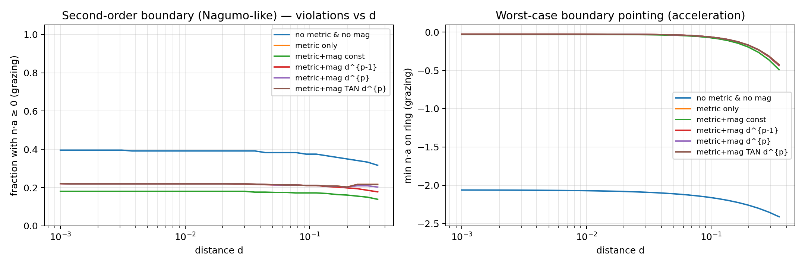
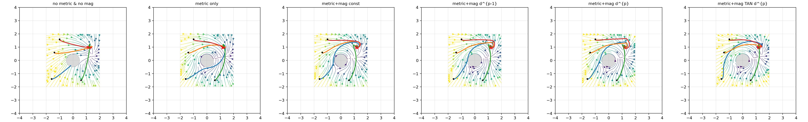
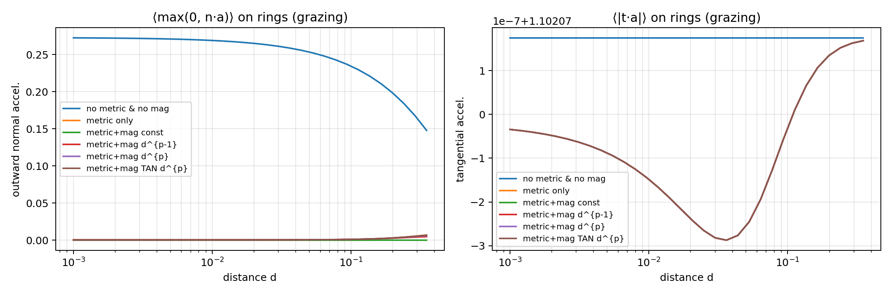
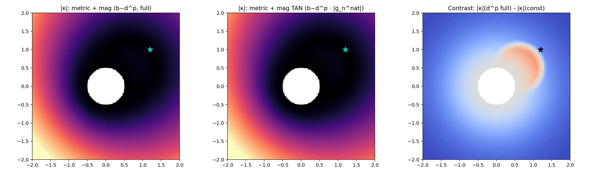
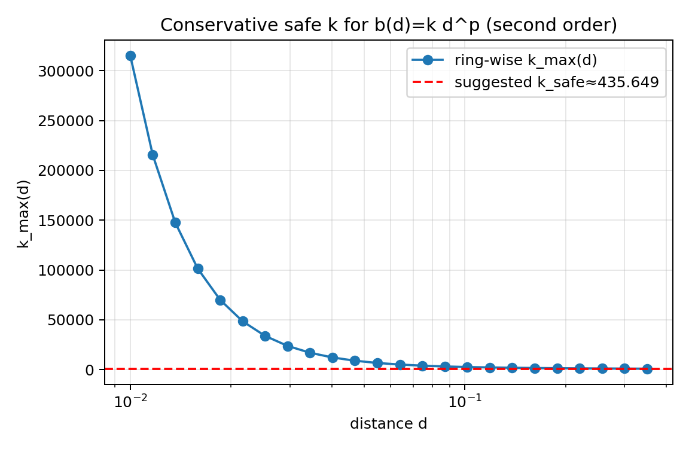

# Tuning **M(q)** and **N(q)** for Safe and Agile Trajectory Shaping

> :warning: **This work is still under review and should not be used as a formal reference**

# A. Round obstacles
We derive and tune a **second‑order** obstacle‑aware geometric controller **without** modifying the goal potential:
$$
\psi(q)=\tfrac12\|q-q_g\|^2,
$$
so all obstacle intelligence comes from:
- an **anisotropic metric** $M(q)$ that raises normal “inertia” near the boundary; and
- a **gyroscopic** two‑form $N(q)$ (skew) that **bends** trajectories but does **no work** on the energy.

### 1. Euler–Lagrange with Levi–Civita and gyroscopic two‑form

We work on $\mathcal{Q}\subset\mathbb{R}^2$ with
$$\begin{align}
&\mathcal{L}(q,\dot{q})=\tfrac12\,\dot q^\top M(q)\dot q + A(q)\cdot\dot q - \psi(q),\\ 
&B=dA,\\ &B(q)^\top=-B(q),
\end{align}$$
and add Rayleigh damping $c_dM(q)\dot q$. The Euler–Lagrange equations are:
$$
\boxed{M(q)\ddot q + C(q,\dot q) \dot q + c_d M(q)\dot q + \nabla\psi(q) = N(q) \dot q,}
$$
with the **Levi–Civita** term
$$\begin{align}
\big(C(q,\dot q)\dot q\big)^i &= \sum_{j,k}\Gamma^i_{jk}(q)\dot q^j\dot q^k,\\
\Gamma^i_{jk} &= \frac12\sum_\ell M^{i\ell}(\partial_j M_{\ell k}+\partial_k M_{\ell j}-\partial_\ell M_{jk}),
\end{align}$$
and $N(q) = \begin{bmatrix} 0 & -B(q)\\ B(q) & 0\end{bmatrix}$.
Define energy $\mathcal{H}(q,\dot q)=\tfrac12\dot q^\top M(q)\dot q+\psi(q)$. Using the Levi–Civita identity and $B^\top=-B$, we get the **exact** balance
$$
\boxed{\dot{\mathcal{H}} = -c_d\dot q^\top M(q)\dot q \le 0,}
$$
i.e., geometry $C$ and gyroscopic $B$ **do not** change $\mathcal{H}$. Gyroscopic/skew terms do no work, they bend trajectories without altering energy. [[6]](https://link.springer.com/book/10.1007/978-1-4757-2063-1)

### 2. Obstacle‑aware metric and two‑form

For a disk obstacle with center $c$ and radius $r$, write
$$\begin{cases}
d(q)=\|q-c\|-r,\\ n(q)=\frac{q-c}{\|q-c\|},\\ t(q)=J\,n(q),
\end{cases}$$
with $J = \begin{bmatrix}0 & -1\\ 1 & 0\end{bmatrix}$ a 90° rotation.
We shape
$$
\boxed{M(q)=m_0 I_2+\alpha s(d(q)) n(q)n(q)^\top,\qquad s(d)=\frac{1}{d^2+\varepsilon^2}\;,}
$$
with $m_0>0$ the original mass of the agent, $\alpha>0$, $0<\varepsilon\ll r$. This increases the **normal** inertia $m_n=m_0+\alpha s(d)$ as $d\to 0^+$ while keeping the **tangential** inertia $m_t=m_0$ unchanged.

We implement the gyroscopic two‑form as
$$
\boxed{\;N(q)=B(q)J,}
$$
and will compare four laws:
$$
B(q)\in\{ 0 \text{ (none)}; \text{const}; \propto d^{p-1}; \propto d^{p} \}.
$$
The last law $B(q)=k\,d^{p}$ is the **final tuning** we’ll defend below: it aligns the gyroscopic **normal injection** with the metric’s near‑boundary scaling.

> **Why not a barrier in $\psi$?**  
> We want the **entire** obstacle intelligence to come from $M$ and $N$ so that tuning and geometric interpretation are explicit—much like in classical Artificial Potential Fields (APF) and Navigation Function (NF) literature but now in a **second‑order** setting, where swirl near obstacles is well known if the gains are not distance‑aware. [[1]](https://link.springer.com/content/pdf/10.1007/s41884-020-00028-0.pdf)[[2]](https://www.mathnet.ru/php/getFT.phtml?jrnid=iimi&paperid=466&what=fullt&option_lang=eng)

### 3. Near‑obstacle asymptotics & a Nagumo‑like test

Let $R=[\vec t , \vec n]$ be the local frame on the boundary, then
$$\begin{cases}
M=R\ \mathrm{diag}(m_t, m_n)R^\top,\\ m_t=m_0,\\ m_n=m_0+\alpha s(d).
\end{cases}$$
The **natural gradient** under this metric is a projection of the standard gradient $\nabla f = [g_t^{*} \vec t + g_n^{*} \vec n]$ under a rescaling of the metric: $\tilde \nabla f = M^{-1}\nabla f$. This is an improved  gradient  in non-euclidian contexts, such as with anisotropic inertia. Matrix $R$ is an orthogonal matrix, thus its inverse is 
$$
M^{-1} = R\ \mathrm{diag}(1/m_t, 1/m_n) R^\top.
$$
So the natural gradient has components $g_t=\mathcal O(1)$ and $g_n\sim C d^{p}$ (because $m_n\sim \alpha/d^2$ so $m_n^{-1}\sim d^2$ with $p>1$ we retain sufficient vanishing near the boundary). The gyroscopic injection along the **normal** at a boundary graze is
$$
\vec n \cdot (N(q)\dot q)=B(q)(\vec t\cdot\vec{\dot{q}}).
$$
Thus, to avoid inward push arbitrarily close to the boundary, a **second‑order Nagumo‑like** condition (at grazing: $n \cdot \vec v=0$) asks for
$$
\boxed{\vec n \cdot \vec a \ge 0\quad\text{for }d\to 0^+.}
$$
Choosing
$$
\boxed{B(q)=k d(q)^{p},\quad p>1\,}
$$
makes the gyroscopic normal term **vanish** at the **same order** as the metric’s normal suppression, preserving boundary invariance while keeping the **curvature** bounded. Note that 
$$\begin{align}
m_n(d)&=m_0+\alpha s(d)\sim \frac{\alpha}{d^2+\varepsilon^2} \\ 
&\Rightarrow\quad
|\kappa|(d) \approx \frac{b(d)}{m_n(d) \|v\|}\\&\sim\;\frac{k d^p}{\alpha/(d^2+\varepsilon^2)}\frac{1}{\|v\|}
\sim \frac{k}{\alpha} \frac{d^{p+2}}{\|v\|} .
\end{align}$$

Hence, for **$p>1$**, $|\kappa|$ not only remains **bounded** but actually **tends to zero** as $d\to 0^+$. Therefore the absolute curvature maps look flat in the near‑field and a **contrast** or **normalized** view is needed to see the improvement ring. 

The curvature of the gyroscopic part can be approximated by observing that the magnetic lateral acceleration magnitude is 
$$
\begin{align}\|a^{(B)}\| &= \frac{\|B(q)J\dot{q}\|}{m_{eff}}\\
&\approx \frac{|B(q)| \|\dot{q}\|}{m_{eff}},
\end{align}
$$
so from $a_n = v^2\kappa$ we find that the curvature of the trajectories can be approximated as
$$\kappa_B\approx \frac{k d(q)^p}{m_{eff}\|\dot q\|}$$
(curvature of integral curves scales like $|\kappa|\sim |v\times a|/|v|^3$, so unbounded $B(q)$ can explode $\kappa$ at small $d$). This is the second‑order counterpart of the APF folklore (*distance‑aware swirl*) and the formal **viability** lens (boundary tangency). [[1]](https://link.springer.com/content/pdf/10.1007/s41884-020-00028-0.pdf)[[4]](https://cs.stanford.edu/group/manips/publications/pdfs/Khatib_1985.pdf)

---

### 4. What the data say

We now simulate the full **second‑order** model (Euler–Lagrange with Levi–Civita and gyroscopic two‑form) using  
$$\begin{cases}
\alpha=0.8,\\ 
p=2.5,\\
\varepsilon=0.08,\\
k_B=0.6
\end{cases}$$ and a moderate damping $c_d=1.2$ that guarantees **convergence** while retaining **some** underdamped behavior in turns. We will now go throug some images that are obtained with [´scripts/tuning_roundObstacle.py´](scripts/tuning_roundObstacle.py)

#### 4.1 A — Boundary invariance vs distance (second‑order grazing test)

We evaluate the **fraction** of boundary samples (rings in $d$, angles, and a few tangential grazing speeds) that satisfy the **second‑order Nagumo‑like** condition $\vec n\cdot \vec a\ge 0$ at **grazing** ($\vec n\cdot \vec v=0$).

*   **metric + gyroscopic $d^{p}$** (and **TAN $d^{p}$**) approach **full compliance** as $d\to 0$, in line with the asymptotics.
*   **metric only** can be compliant at many distances thanks to the strong normal inertia, but **worst‑case $\vec n\cdot\vec a$** remains less favorable than with $d^p$ in the smallest‑$d$ regime.
*   **const** and **$d^{p-1}$** retain violations near the boundary: gyroscopic normal injection does not vanish fast enough.

#### 4.2 B — Trajectories by mode

Each panel overlays **second‑order trajectories** (four starts; small initial tangential velocity to expose underdamping) on an **acceleration streamline** backdrop evaluated at **grazing speed**.

*   **metric only** often looks “decent,” but **metric+mag $d^{p}$** and especially **TAN $d^{p}$** turn **earlier** and **cleaner** near the obstacle without skimming it—exactly what the invariance test predicts.
*   **const** and **$d^{p-1}$** either skim or inject too much normal acceleration near the boundary.  
    The **TAN** flavor moderates curvature while preserving progress, which the next plots quantify.

#### 4.3 C — Ring-averaged outward/tangential *accelerations* (grazing)

Here, we report $\langle\max(0, n\!\cdot a)\rangle$ and $\langle|t\!\cdot a|\rangle$ at **grazing**.

*   **$d^p$** keeps outward **normal acceleration** nonnegative in the small‑$d$ regime and still provides **tangential acceleration**, that is, it can “slide and turn” without pushing inward.
*   **const** and **$d^{p-1}$** have higher tangential acceleration but at the expense of **inward** normal acceleration near the boundary; **metric only** has small tangential acceleration (conservative but slower).

#### 4.4 D — Curvature maps: near‑field contrast

figs/figD\_curvature\_dp\_SO.png

We display $|\kappa|$ for **full $d^p$** and **TAN $d^p$** and, in the third panel, a **near‑field contrast** $\Delta \kappa_{\text{near}}=(|\kappa|_{\text{const}}-|\kappa|_{d^p})w_{\text{near}}(d)$ with $w_{\text{near}}$ suppressing far‑field influence.

*   The raw $d^p$ curvature **tends to zero** at the boundary (metric makes $m_n$ blow up), so **absolute maps** look flat in the near‑field—this is expected from the theory.
*   The **near‑field contrast** makes the **benefit ring** around the obstacle visible: **$d^p$** (and TAN) **reduce** curvature relative to **const** in that annulus; the far‑field is de‑emphasized by $w_{\text{near}}$.  

#### 4.5 F — Conservative safe gain $$k$$ for $$b(d)=k\,d^{p}$$

Same ring‑based diagnostic as before, but with the **natural gradient** under your metric $M(q)$. We plot $k_{\max}(d)=\max\{g_n/(d^{p}g_t)\}$ and suggest $k_{\text{safe}}=\frac12\min_d k_{\max}(d)$. The **optimized** $k_B=0.6$ falls comfortably below the conservative envelope obtained at $(\alpha=0.8,p=2.5,\varepsilon=0.08)$.

> **Take‑home.** With the optimized $(\alpha,p,\varepsilon,k_B)$, **metric+mag $d^p$** (and **TAN $d^p$**) achieve **better boundary compliance** and **cleaner turns** in the annulus where it matters, while the **metric** provides a robust normal shield. The raw curvature near the obstacle **vanishes** (as theory predicts), so we visualize **contrast** (or **normalized curvature**) to reveal the improvement ring.

---

## 5. Tuning rules (second order, final)

1. **Metric:** choose $p>1$ and small $\varepsilon\ll r$ in $M(q)=m_0 I+\alpha s(d)nn^\top$ with $s(d)=1/(d^2+\varepsilon^2)$. Larger $\alpha$ narrows the boundary layer.  
2. **Gyroscopic law:** set $\boxed{b(d)=k\,d^{p}}$ near the obstacle (tangential‑only modulation optional extremely close to the boundary).  
3. **Gain selection:** read **$k_{\text{safe}}$** off the F5 chart and set $k\le k_{\text{safe}}$.  
4. **Damping:** keep $c$ small enough to exhibit **underdamped agility** but not so small that numerical stiffness dominates. Energy still decays by design.

> **Context.** APF and NF methods motivate distance‑aware shaping near obstacles; we keep the potential **unchanged** and put all structure into $M$ and $B$, guided by the **second‑order** near‑boundary balance and a viability/Nagumo‑like test. [[1]](https://link.springer.com/content/pdf/10.1007/s41884-020-00028-0.pdf)[[2]](https://www.mathnet.ru/php/getFT.phtml?jrnid=iimi&paperid=466&what=fullt&option_lang=eng)

---

## References

1. O. Khatib, “Real-Time Obstacle Avoidance for Manipulators and Mobile Robots,” *IJRR*, 1986.  
2. S. Paternain, D.E. Koditschek, A. Ribeiro, “Navigation Functions for Convex Potentials in a Space with Convex Obstacles,” *arXiv:1605.00638*, 2016.  
3. H. Kumar, S. Paternain, A. Ribeiro, “Navigation of a Quadratic Potential with Ellipsoidal Obstacles,” *arXiv:1908.08509*, 2022.  
4. A.D. Ames, X. Xu, J.W. Grizzle, P. Tabuada, “Control Barrier Function Based Quadratic Programs for Safety Critical Systems,” *IEEE TAC*, 2016.  
5. (Background) Texts on Riemannian/natural gradients and viability/Nagumo conditions.
